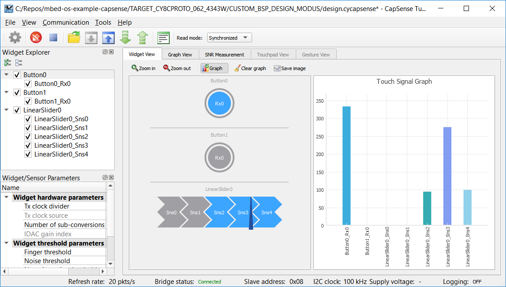
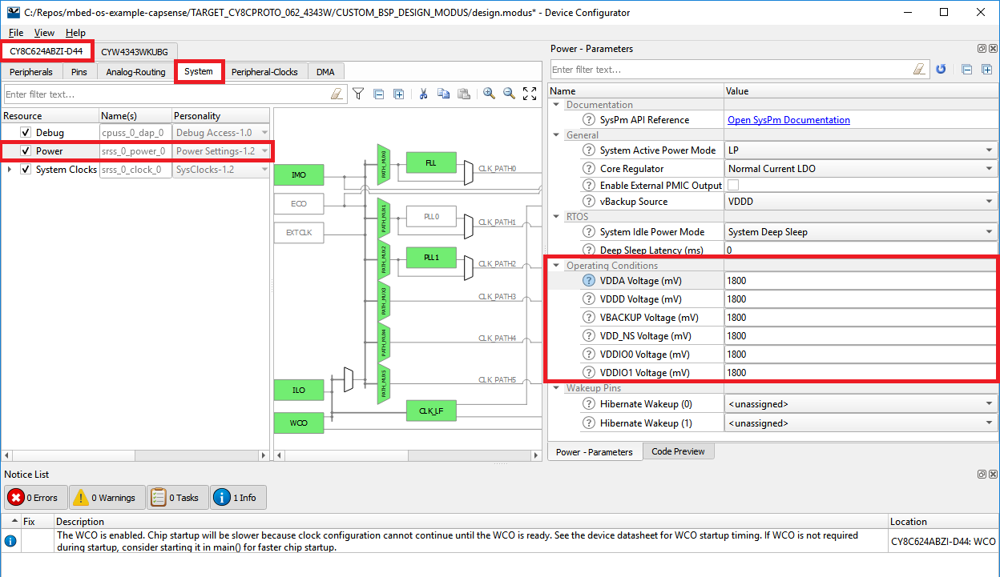
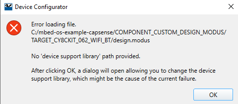
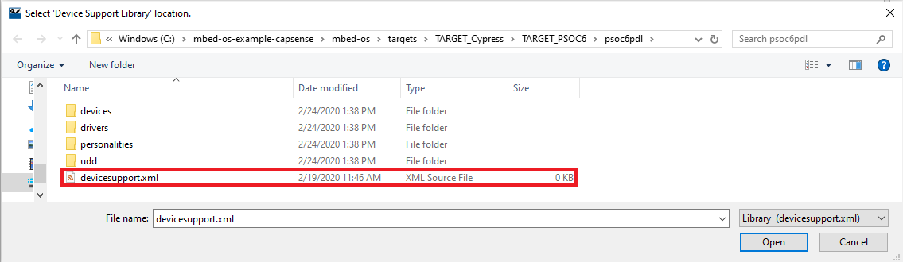
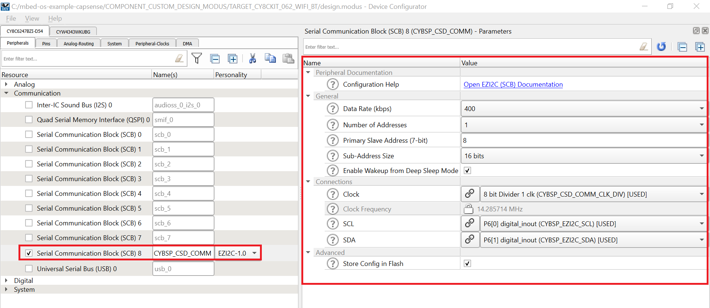
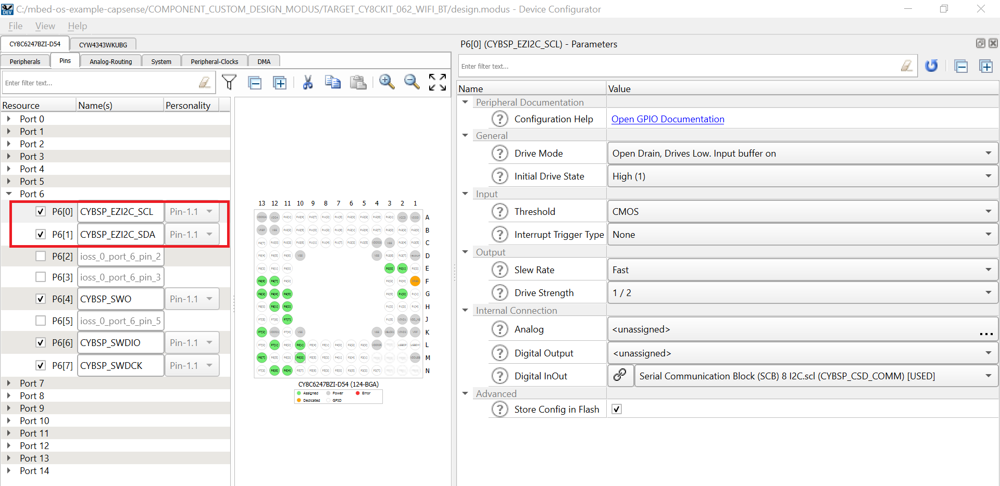
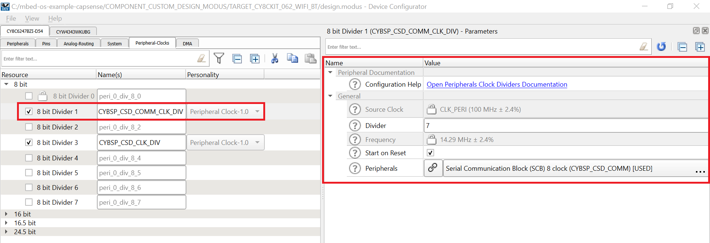

# PSoC 6 MCU: CapSense Buttons and Slider

This code example demonstrates implementing CapSense® buttons and slider for PSoC® 6 MCU with Mbed OS using the [CapSense Middleware Library](https://github.com/cypresssemiconductorco/capsense) and [Mbed OS v5.15.1](https://github.com/ARMmbed/mbed-os/releases/tag/mbed-os-5.15.1). This example features a 5-segment CapSense slider and two CapSense buttons. 

## Requirements

- [Mbed CLI](https://github.com/ARMmbed/mbed-cli)
- CapSense Tuner, Device Configurator - installed as part of [ModusToolbox™ IDE](https://www.cypress.com/products/modustoolbox-software-environment) v2.0
- Programming Language: C++
-  All [PSoC® 6 MCU](http://www.cypress.com/PSoC6) parts

## Supported Kits (Target Names)
- CY8CPROTO-062-4343W [PSoC 6 Wi-Fi BT Prototyping Kit](https://www.cypress.com/CY8CPROTO-062-4343W) (CY8CPROTO_062_4343W)
- CY8CKIT-062-WiFi-BT [PSoC 6 WiFi-BT Pioneer Kit](https://www.cypress.com/CY8CKIT-062-WiFi-BT) (CY8CKIT_062_WIFI_BT)
- CY8CKIT-062-BLE [PSoC 6 BLE Pioneer Kit](https://www.cypress.com/CY8CKIT-062-BLE) (CY8CKIT_062_BLE)
- CY8CKIT-062S2-43012 [PSoC 62S2 Wi-Fi BT Pioneer Kit](https://www.cypress.com/CY8CKIT-062S2-43012) (CY8CKIT_062S2_43012)
- CYW9P62S1-43438EVB-01 [PSoC 62S1 Wi-Fi BT Pioneer Kit](https://www.cypress.com/CYW9P62S1-43438EVB-01) (CYWP62S1_43438EVB_01)
- CYW9P62S1-43012EVB-01 [PSoC 62S1 Wi-Fi BT Pioneer Kit](https://www.cypress.com/CYW9P62S1-43012EVB-01) (CYWP62S1_43012EVB_01)

## Hardware Setup

This example uses the kit's default configuration. Refer to the kit guide to ensure that the kit is configured correctly. Since this example is designed to work at the default operating voltage of the kit, ensure that the power setting jumper when present is configured at the default position. For the kits that support multiple operating voltages, see [Operation at Custom Power Supply Voltage](#operation-at-custom-power-supply-voltage) to run this example at a non-default voltage. 

**Note**: The PSoC 6 BLE Pioneer Kit and the PSoC 6 WiFi-BT Pioneer Kit ship with KitProg2 installed. ModusToolbox software requires KitProg3. Before using this code example, make sure that the board is upgraded to KitProg3. The tool and instructions are available in the [Firmware Loader](https://github.com/cypresssemiconductorco/Firmware-loader) GitHub repository. If you do not upgrade, you will see an error like "unable to find CMSIS-DAP device" or "KitProg firmware is out of date".

## Software Setup

This example requires [CapSense Tuner](https://www.cypress.com/ModusToolboxCapSenseTuner), which is installed as part of [ModusToolbox™ IDE](https://www.cypress.com/products/modustoolbox-software-environment) v2.0. Refer to the [ModusToolbox Installation Guide](http://www.cypress.com/ModusToolboxInstallGuide) for installation instructions.

This example also requires a terminal emulator. Instructions in this document use the terminal provided by Mbed CLI. 

## Using the Code Example in Mbed CLI Tools

1. Import the code example into your mbed directory using the following mbed command:

   ```
   mbed import https://github.com/cypresssemiconductorco/mbed-os-example-capsense
   ```

2. Change the working directory to the code example folder:

   ```
   cd mbed-os-example-capsense
   ```

3. Connect the board to your PC using the provided USB cable through the USB connector.

4. Put the kit in DAPLink mode to allow programming from Mbed CLI. See [Firmware-loader](https://github.com/cypresssemiconductorco/Firmware-loader) to learn to update the firmware and switch to DAPLink mode.

5. Compile the code and program the target board:

   ```
   mbed compile --target CY8CPROTO_062_4343W --toolchain GCC_ARM --flash --sterm
   ```

   **Note:** With the `--sterm` option, Mbed CLI opens a serial terminal with 9600-8N1 as the setting after programming completes. Do not use this option if you want to connect using another serial terminal application.

## Operation

1. After programming, the following message is displayed on the terminal when the application starts running:

   ```
   Application has started. Touch any CapSense button or slider.
   ```

2. Touch the buttons or the slider to observe the User LED changing its state (ON when touched and OFF when not touched) and the status printed on the serial terminal. 

3. You can also monitor the CapSense data using the CapSense Tuner application as follows:

### Monitor Data Using CapSense Tuner

1. Open *\<user_home>/ModusToolbox/tools_2.0/capsense-configurator/capsense-tuner* to run the CapSense Tuner application. 

2. Select **File** > **Open** and open the *design.cycapsense* file in the example directory for the respective kit, in *<application_folder>/CUSTOM_BSP_DESIGN_MODUS/TARGET_\<kit>/design.cycapsense*. 

3. Switch the kit from DAPLink mode to KitProg3 mode. See [Firmware-loader](https://github.com/cypresssemiconductorco/Firmware-loader) to learn on how to update the firmware and switch to KitProg3 mode.

4. In the Tuner application, click **Tuner Communication Setup** or select **Tools** > **Tuner Communication Setup**. In the window that appears, select the I2C checkbox under KitProg3 and configure as follows: 

        I2C Address: 8
        Sub-address: 2-Bytes
        Speed (kHz): 400

5. Click **Connect** or select **Communication** > **Connect**.

6. Click **Start** or select **Communication** > **Start**.

Under the **Widget View** tab, you can see the corresponding widgets highlighted in blue color when you touch the button or slider. You can also view the sensor data in the **Graph View** tab. For example, to view the sensor data for Button 0, select **Button0_Rx0** under **Button0**. 

[Figure 1](#figure-1-capsense-tuner-showing-touch-data) shows the CapSense Tuner displaying the status of CapSense touch on Button0 and LinearSlider0.

##### Figure 1. CapSense Tuner Showing Touch Data


See the [ModusToolbox CapSense Tuner Guide](https://www.cypress.com/ModusToolboxCapSenseTuner) (**Help** > **View Help**) for more information. 

## Design and Implementation

In this project, PSoC 6 MCU scans a self-capacitance (CSD) based, 5-element CapSense slider and two mutual capacitance (CSX) CapSense buttons for user input. The project uses the CapSense middleware; see [ModusToolbox User Guide](http://www.cypress.com/ModusToolboxUserGuide) for details on selecting the middleware. See [AN85951 – PSoC 4 and PSoC 6 MCU CapSense Design Guide](https://www.cypress.com/an85951) for more details of CapSense features and usage. 

This example turns the User LED ON when any of the widgets is touched and OFF when none of them are touched, and prints the button status and slider position over the serial port. 

This example enables CapSense Tuner communication over I2C for CapSense data monitoring. This example uses the following RTOS objects and runs a thread for periodic CapSense scan apart from the `main()` thread. 

**Semaphore:** The scan loop calls `acquire()` to acquire a semaphore while initiating the scan. In subsequent loops, the program waits to acquire the semaphore before initiating the next scan and processes the touch information. The semaphore is released at the end of the scan callback.

**EventQueue:** The dispatcher of the EventQueue is run inside a thread to periodically scan the sensors. 

The [ModusToolbox CapSense Configurator Tool Guide](https://www.cypress.com/ModusToolboxCapSenseConfig) describes step-by-step instructions on how to  launch and use CapSense Configurator in ModusToolbox. The CapSense Configurator Tool can be launched in ModusToolbox IDE from the CSD personality, as well as in stand-alone mode.

## Operation at Custom Power Supply Voltage

[Table 1](#table-1-operating-voltages-supported-by-the-kits) lists the power supply voltages supported by each kit along with the default operating voltage.

##### Table 1. Operating Voltages Supported by the Kits

| Kit                   | Supported Operating Voltages | Default Operating Voltage |
| :-------------------- | ---------------------------- | ------------------------- |
| CY8CPROTO-062-4343W   | 3.3 V / 1.8 V                | 3.3 V                     |
| CY8CKIT-062-BLE       | 3.3 V / 1.8 V                | 3.3 V                     |
| CY8CKIT-062-WIFI-BT   | 3.3 V / 1.8 V                | 3.3 V                     |
| CY8CKIT-062S2-43012   | 3.3 V / 1.8 V                | 3.3 V                     |
| CYW9P62S1-43438EVB-01 | 3.3 V Only                   | 3.3 V                     |
| CYW9P62S1-43012EVB-01 | 1.8 V Only                   | 1.8 V                     |

For the kits that support multiple operating voltages, do the following to work at a custom power supply, such as 1.8 V:

1. Open */<user_home>/ModusToolbox/tools_2.0/device-configurator/device-configurator* to run the [Device Configurator](https://www.cypress.com/ModusToolboxDeviceConfig) tool.

2. Select **File** > **Open**. Navigate to and open *design.modus* file for the respective kit: *\<application_folder>/TARGET_\<kit>/CUSTOM_BSP_DESIGN_MODUS/design.modus*. 

3. Update the operating conditions as shown in [Figure 2](#figure-2-power-settings-to-work-with-18-v) and select **File** > **Save**.

   ##### Figure 2. Power Settings to Work with 1.8 V
   

4. Change the jumper/switch setting as listed in [Table 2](#table-2-jumperswitch-position-for-18-v-operation). 

   ##### Table 2. Jumper/Switch Position for 1.8 V Operation

   | Kit                 | Jumper/Switch Position |
   | :------------------ | ---------------------- |
   | CY8CPROTO-062-4343W | J3 (1-2)               |
   | CY8CKIT-062-BLE     | SW5 (1-2)              |
   | CY8CKIT-062-WIFI-BT | SW5 (1-2)              |
   | CY8CKIT-062S2-43012 | J14 (1-2)              |

5. Re-build and program the application to evaluate the application at the new power setting. 

## Creating Custom Device Configurations

The code example overrides the default device configuration provided in *<application_folder>/mbed-os/targets/TARGET_Cypress/TARGET_PSOC6/TARGET_\<kit>/COMPONENT_BSP_DESIGN_MODUS* with the one provided in *<application_folder>/COMPONENT_CUSTOM_DESIGN_MODUS/TARGET_\<kit>* for the supported kits. The custom configuration has source files (cycfg_capsense.c/.h) generated using the CapSense Configurator. The CapSense middleware requires these files. The default configurations that ship with Mbed OS do not contain these files. You can create a custom configuration for a new kit by following the steps below.

1. Create a new directory inside *COMPONENT_CUSTOM_DESIGN_MODUS* with the same name as the target you are building the example for, such as *<application_folder>/COMPONENT_CUSTOM_DESIGN_MODUS/TARGET_\<kit>*.

2. Copy the contents of the folder *COMPONENT_BSP_DESIGN_MODUS* at *<application_folder>/mbed-os/targets/TARGET_Cypress/TARGET_PSOC6/TARGET_\<kit>/COMPONENT_BSP_DESIGN_MODUS* into the folder created in the above step except the *GeneratedSource* folder.  

   **Note**: The files *design.cycapsense* and *design.qspi* are copied so that you don't have to configure these peripherals again. All you have to do is to enable these peripherals in *design.modus* to use them.  

3. Open the copied *design.modus* using Device Configurator. You will be prompted to provide a path to the device support library as shown in [Figure 3](#figure-3-prompt-for-device-support-library-path).

   ##### Figure 3. Prompt for Device Support Library Path
   

4. Click **OK** and provide the path to the device support library in *mbed-os/targets/TARGET_Cypress/TARGET_PSOC6/psoc6pdl/devicesupport.xml* as shown in [Figure 4](#figure-4-select-devicesupport.xml).

   ##### Figure 4. Select devicesupport.xml
   

5. The default configuration does not enable EZI2C peripheral for the device. The EZI2C peripheral communicates with CapSense Tuner. Select the SCB whose pins are connected to the KitProg I2C lines by referring to the schematic. Enable the SCB as an EZI2C peripheral from the `Personality` drop-down menu and configure as shown in [Figure 5](#figure-5-configure-ezi2c). Since same set of I2C pins can be supported by multiple SCBs, select the SCB that can wake-up the device from deep sleep for the pins that are connected to the I2C lines of KitProg. In [Figure 5](#figure-5-configure-ezi2c), SCB8 is selected.

   ##### Figure 5. Configure EZI2C
   

   **Note**: If the SCB block is not deep sleep wake-up capable, use `sleep_manager_lock_deep_sleep()` in `main` to prevent the device from entering deep sleep when using CapSense Tuner. 

   For example, CYW9P62S1-43012EVB-01 has the I2C lines connected to P1[0] and P1[1] which are not associated with a deep sleep wake-up capable SCB. 

6. In the **Pins** tab, provide aliases to the EZI2C pins as shown in [Figure 6](#figure-6-configure-pins).

   ##### Figure 6. Configure EI2C Pins
   

7. In the **Peripheral Clocks** tab, provide an alias to the EZI2C peripheral clock divider as shown in [Figure 7](#figure-7-configure-ezi2c-peripheral-clock-divider).

   ##### Figure 7. Configure EZI2C Peripheral Clock Divider
   

8. Save the file to generate the source files.

9. Disable the default configuration in *<application_folder>/mbed-os/targets/TARGET_Cypress/TARGET_PSOC6/TARGET_\<kit>/COMPONENT_BSP_DESIGN_MODUS* and enable the custom configuration in *<application_folder>/COMPONENT_CUSTOM_DESIGN_MODUS/TARGET_\<kit>* by making the following changes in *mbed_app.json*:
   ```
   "<kit>": {
   "target.components_remove": ["BSP_DESIGN_MODUS"],
   "target.components_add":["CUSTOM_DESIGN_MODUS"]
   }
   ```
## Related Resources

| Application Notes                                            |                                                              |
| :----------------------------------------------------------- | :----------------------------------------------------------- |
| [AN228571](https://www.cypress.com/AN228571) – Getting Started with PSoC 6 MCU on ModusToolbox | Describes PSoC 6 MCU devices and how to build your first application with ModusToolbox |
| [AN221774](https://www.cypress.com/AN221774) – Getting Started with PSoC 6 MCU on PSoC Creator | Describes PSoC 6 MCU devices and how to build your first application with PSoC Creator |
| [AN210781](https://www.cypress.com/AN210781) – Getting Started with PSoC 6 MCU with Bluetooth Low Energy (BLE) Connectivity on PSoC Creator | Describes PSoC 6 MCU with BLE Connectivity devices and how to build your first application with PSoC Creator |
| [AN85951](https://www.cypress.com/AN85951) – PSoC 4 and PSoC 6 MCU CapSense Design Guide | The PSoC 4 and PSoC 6 MCU CapSense Design Guide shows how to design capacitive touch sensing applications with the PSoC 4, PSoC 6 families of devices |
| **Code Examples**                                            |                                                              |
| [Using Mbed OS](https://github.com/cypresssemiconductorco?q=mbed-os-example%20NOT%20Deprecated) |                                                              |
| [Using ModusToolbox IDE](https://github.com/cypresssemiconductorco/Code-Examples-for-ModusToolbox-Software) | [Using PSoC Creator](https://www.cypress.com/documentation/code-examples/psoc-6-mcu-code-examples) |
| **Device Documentation**                                     |                                                              |
| [PSoC 6 MCU Datasheets](https://www.cypress.com/search/all?f[0]=meta_type%3Atechnical_documents&f[1]=resource_meta_type%3A575&f[2]=field_related_products%3A114026) | [PSoC 6 Technical Reference Manuals](https://www.cypress.com/search/all/PSoC%206%20Technical%20Reference%20Manual?f[0]=meta_type%3Atechnical_documents&f[1]=resource_meta_type%3A583) |
| **Development Kits**                                         | Buy at [www.cypress.com](www.cypress.com)                    |
| [CY8CKIT-062-BLE](https://www.cypress.com/CY8CKIT-062-BLE) PSoC 6 BLE Pioneer Kit | [CY8CKIT-062-WiFi-BT](https://www.cypress.com/CY8CKIT-062-WiFi-BT) PSoC 6 WiFi-BT Pioneer Kit |
| [CY8CPROTO-063-BLE](https://www.cypress.com/CY8CPROTO-063-BLE) PSoC 6 BLE Prototyping Kit | [CY8CPROTO-062-4343W](https://www.cypress.com/cy8cproto-062-4343w) PSoC 6 Wi-Fi BT Prototyping Kit |
| [CY8CKIT-062S2-43012](https://www.cypress.com/CY8CKIT-062S2-43012) PSoC 62S2 Wi-Fi BT Pioneer Kit |                                                              |
| **Libraries**                                                |                                                              |
| PSoC 6 Peripheral Driver Library and docs                    | [psoc6pdl](https://github.com/cypresssemiconductorco/psoc6pdl) on GitHub |
| Cypress Hardware Abstraction Layer Library and docs          | [psoc6hal](https://github.com/cypresssemiconductorco/psoc6hal) on GitHub |
| **Middleware**                                               |                                                              |
| CapSense library and docs                                    | [capsense](https://github.com/cypresssemiconductorco/capsense) on GitHub |
| Links to all PSoC 6 Middleware                               | [psoc6-middleware](https://github.com/cypresssemiconductorco/psoc6-middleware) on GitHub |
| **Tools**                                                    |                                                              |
| [ModusToolbox IDE](https://www.cypress.com/modustoolbox)     | The Cypress IDE for PSoC 6 and IoT designers                 |
| [PSoC Creator](https://www.cypress.com/products/psoc-creator-integrated-design-environment-ide) | The Cypress IDE for PSoC and FM0+ development                |

## Other Resources

Cypress provides a wealth of data at www.cypress.com to help you select the right device, and quickly and effectively integrate it into your design.

For PSoC 6 MCU devices, see [How to Design with PSoC 6 MCU - KBA223067](https://community.cypress.com/docs/DOC-14644) in the Cypress community.


### Document History

Document Title:  CE226594 - PSoC 6 MCU: CapSense Buttons and Slider

| Version | Description of Change                                        |
| ------- | ------------------------------------------------------------ |
| 1.0.0     | Initial release.<br/>Tested with mbed-os v5.11.4 and CapSense middleware  v1.2 |
| 1.1.0     | Minor update. <br/>Tested with mbed-os v5.13.1 and CapSense middleware  v2.0 |
| 1.2.0     | Updated to work with CapSense Tuner in ModusToolbox 1.1<br/>Tested with mbed-os v5.14 and CapSense middleware v2.0 |
| 1.3.0     | Updated to work with CapSense Tuner in ModusToolbox 2.0<br/>Tested with mbed-os v5.14.1 and CapSense middleware v2.0<br/>Updated *Monitor data using CapSense Tuner* section<br/>Added *Operation at custom power supply* section<br/>Added *Design and Implementation* section |
| 1.4.0     | Readme updates.<br/>Re-structured custom TARGET folders<br/>Added support for CYW9P62S1-43438EVB-01 and CYW9P62S1-43012EVB-01<br/>Added deep sleep callbacks for supporting tickless operation<br/>Tested with mbed-os v5.15.1 and CapSense middleware v2.0<br/>This update is not backward compatible with Mbed OS versions < 5.15.1|

------

All other trademarks or registered trademarks referenced herein are the property of their respective
owners.


-------------------------------------------------------------------------------

© Cypress Semiconductor Corporation, 2019-2020. This document is the property of Cypress Semiconductor Corporation and its subsidiaries ("Cypress").  This document, including any software or firmware included or referenced in this document ("Software"), is owned by Cypress under the intellectual property laws and treaties of the United States and other countries worldwide.  Cypress reserves all rights under such laws and treaties and does not, except as specifically stated in this paragraph, grant any license under its patents, copyrights, trademarks, or other intellectual property rights.  If the Software is not accompanied by a license agreement and you do not otherwise have a written agreement with Cypress governing the use of the Software, then Cypress hereby grants you a personal, non-exclusive, nontransferable license (without the right to sublicense) (1) under its copyright rights in the Software (a) for Software provided in source code form, to modify and reproduce the Software solely for use with Cypress hardware products, only internally within your organization, and (b) to distribute the Software in binary code form externally to end users (either directly or indirectly through resellers and distributors), solely for use on Cypress hardware product units, and (2) under those claims of Cypress's patents that are infringed by the Software (as provided by Cypress, unmodified) to make, use, distribute, and import the Software solely for use with Cypress hardware products.  Any other use, reproduction, modification, translation, or compilation of the Software is prohibited.
TO THE EXTENT PERMITTED BY APPLICABLE LAW, CYPRESS MAKES NO WARRANTY OF ANY KIND, EXPRESS OR IMPLIED, WITH REGARD TO THIS DOCUMENT OR ANY SOFTWARE OR ACCOMPANYING HARDWARE, INCLUDING, BUT NOT LIMITED TO, THE IMPLIED WARRANTIES OF MERCHANTABILITY AND FITNESS FOR A PARTICULAR PURPOSE.  No computing device can be absolutely secure.  Therefore, despite security measures implemented in Cypress hardware or software products, Cypress shall have no liability arising out of any security breach, such as unauthorized access to or use of a Cypress product.  CYPRESS DOES NOT REPRESENT, WARRANT, OR GUARANTEE THAT CYPRESS PRODUCTS, OR SYSTEMS CREATED USING CYPRESS PRODUCTS, WILL BE FREE FROM CORRUPTION, ATTACK, VIRUSES, INTERFERENCE, HACKING, DATA LOSS OR THEFT, OR OTHER SECURITY INTRUSION (collectively, "Security Breach").  Cypress disclaims any liability relating to any Security Breach, and you shall and hereby do release Cypress from any claim, damage, or other liability arising from any Security Breach.  In addition, the products described in these materials may contain design defects or errors known as errata which may cause the product to deviate from published specifications.  To the extent permitted by applicable law, Cypress reserves the right to make changes to this document without further notice. Cypress does not assume any liability arising out of the application or use of any product or circuit described in this document.  Any information provided in this document, including any sample design information or programming code, is provided only for reference purposes.  It is the responsibility of the user of this document to properly design, program, and test the functionality and safety of any application made of this information and any resulting product.  "High-Risk Device" means any device or system whose failure could cause personal injury, death, or property damage.  Examples of High-Risk Devices are weapons, nuclear installations, surgical implants, and other medical devices.  "Critical Component" means any component of a High-Risk Device whose failure to perform can be reasonably expected to cause, directly or indirectly, the failure of the High-Risk Device, or to affect its safety or effectiveness.  Cypress is not liable, in whole or in part, and you shall and hereby do release Cypress from any claim, damage, or other liability arising from any use of a Cypress product as a Critical Component in a High-Risk Device.  You shall indemnify and hold Cypress, its directors, officers, employees, agents, affiliates, distributors, and assigns harmless from and against all claims, costs, damages, and expenses, arising out of any claim, including claims for product liability, personal injury or death, or property damage arising from any use of a Cypress product as a Critical Component in a High-Risk Device.  Cypress products are not intended or authorized for use as a Critical Component in any High-Risk Device except to the limited extent that (i) Cypress's published data sheet for the product explicitly states Cypress has qualified the product for use in a specific High-Risk Device, or (ii) Cypress has given you advance written authorization to use the product as a Critical Component in the specific High-Risk Device and you have signed a separate indemnification agreement.
Cypress, the Cypress logo, Spansion, the Spansion logo, and combinations thereof, WICED, PSoC, CapSense, EZ-USB, F-RAM, and Traveo are trademarks or registered trademarks of Cypress in the United States and other countries.  For a more complete list of Cypress trademarks, visit cypress.com.  Other names and brands may be claimed as property of their respective owners.